# Board adjacency graph

**Auto-generated** from `BOARD_VERIFICATION.md` §3a (white-border adjacency) and §4 (impassable),
via `scripts/gen_graph.py`. Regenerate after editing the board data. This view doubles as a
well-formedness check.

- **Nodes:** 101 areas, grouped into the 9 subgraphs (8 sectors + North Pole).
- **Solid line** = passable white border (ground movement allowed): **265 edges**.
- **Red dashed line** (`-.->|red|`) = impassable border (§4): **11 edges** — NOT traversable.
- **Validation:** the graph is symmetric (every A–B edge appears from both sides), has no isolated
  nodes, and every id resolves. Highest-degree areas: `s6_1` & `wind_pass` (8) — the North-Pole ring.

> Tip: GitHub renders the Mermaid block below as an interactive node-and-edge diagram.

```mermaid
graph TD
  subgraph s1["s1 NE-outer"]
    gara_kulon
    s1_1
    s1_10
    s1_11
    s1_12
    s1_13
    s1_14
    s1_15
    s1_16
    s1_2
    s1_3
    s1_4
    s1_5
    s1_6
    s1_7
    s1_8
    s1_9
    sihaya_ridge
  end
  subgraph s2["s2 SE-outer"]
    pasty_mesa
    s2_1
    s2_2
    s2_3
    s2_4
    s2_5
    s2_6
    s2_7
    s2_8
    tasmin_sink
  end
  subgraph s3["s3 SW-outer"]
    habbanya_ridge
    s3_1
    s3_2
    s3_3
    s3_4
    s3_5
    s3_6
    s3_7
    s3_8
    s3_9
  end
  subgraph s4["s4 NW-outer"]
    bight_of_the_cliff
    rock_outcroppings
    s4_1
    s4_10
    s4_11
    s4_12
    s4_13
    s4_14
    s4_15
    s4_16
    s4_2
    s4_3
    s4_4
    s4_5
    s4_6
    s4_7
    s4_8
    s4_9
    the_funeral_plain
    the_great_flat
  end
  subgraph s5["s5 NE-inner"]
    arrakeen
    broken_land
    carthag
    hole_in_the_rock
    imperial_basin
    rimwall_west
    s5_1
    s5_2
    s5_3
    s5_4
    s5_5
    s5_6
    s5_7
    s5_8
    s5_9
    shield_wall_1
  end
  subgraph s6["s6 SE-inner"]
    false_wall_east
    false_wall_south
    harg_pass
    hobars_gap
    s6_1
    s6_2
    s6_3
    s6_4
    s6_5
  end
  subgraph s7["s7 SW-inner"]
    false_wall_west
    s7_1
    s7_2
    s7_3
    s7_4
    s7_5
    s7_6
    windgap
  end
  subgraph s8["s8 NW-inner"]
    arsunt
    hagga_basin
    s8_1
    s8_2
    s8_3
    s8_4
    shield_wall_2
    splintered_rock
    wind_pass
  end
  subgraph np["North Pole"]
    north_pole
  end
  arrakeen --- broken_land
  arrakeen --- carthag
  arrakeen --- imperial_basin
  arrakeen --- rimwall_west
  arrakeen --- s5_1
  arsunt --- broken_land
  arsunt --- carthag
  arsunt --- hagga_basin
  arsunt --- s4_16
  arsunt --- shield_wall_2
  bight_of_the_cliff --- s4_12
  bight_of_the_cliff --- s4_13
  bight_of_the_cliff --- s4_6
  bight_of_the_cliff --- s4_7
  bight_of_the_cliff --- s8_3
  broken_land --- carthag
  broken_land --- rimwall_west
  broken_land --- s4_16
  carthag --- hagga_basin
  carthag --- s5_1
  false_wall_east --- harg_pass
  false_wall_east --- s5_4
  false_wall_east --- s5_7
  false_wall_east --- s6_1
  false_wall_east --- s6_2
  false_wall_east --- s6_3
  false_wall_south --- harg_pass
  false_wall_south --- hobars_gap
  false_wall_south --- s2_5
  false_wall_south --- s2_8
  false_wall_south --- s6_3
  false_wall_south --- s6_4
  false_wall_west --- s3_5
  false_wall_west --- s3_8
  false_wall_west --- s7_1
  false_wall_west --- s7_2
  false_wall_west --- windgap
  gara_kulon --- s1_11
  gara_kulon --- s1_12
  gara_kulon --- s1_14
  gara_kulon --- s1_15
  gara_kulon --- s1_16
  gara_kulon --- s5_9
  gara_kulon --- shield_wall_1
  habbanya_ridge --- s3_1
  habbanya_ridge --- s3_2
  habbanya_ridge --- s3_3
  habbanya_ridge --- s3_4
  habbanya_ridge --- s3_5
  habbanya_ridge --- s3_6
  hagga_basin --- s5_1
  hagga_basin --- s5_2
  hagga_basin --- s8_2
  hagga_basin --- shield_wall_2
  hagga_basin --- splintered_rock
  harg_pass --- s6_1
  harg_pass --- s6_3
  harg_pass --- s6_4
  hobars_gap --- s2_8
  hobars_gap --- s6_4
  hobars_gap --- s6_5
  hole_in_the_rock --- imperial_basin
  hole_in_the_rock --- s5_1
  hole_in_the_rock --- s5_2
  hole_in_the_rock --- s5_3
  hole_in_the_rock --- s5_4
  imperial_basin --- rimwall_west
  imperial_basin --- s5_1
  imperial_basin --- s5_4
  imperial_basin --- s5_5
  north_pole --- s5_3
  north_pole --- s6_1
  north_pole --- s7_4
  north_pole --- wind_pass
  pasty_mesa --- s1_15
  pasty_mesa --- s2_1
  pasty_mesa --- s2_5
  pasty_mesa --- s5_9
  pasty_mesa --- s6_2
  pasty_mesa --- s6_3
  pasty_mesa --- tasmin_sink
  rimwall_west --- s5_5
  rock_outcroppings --- s4_10
  rock_outcroppings --- s4_2
  rock_outcroppings --- s4_3
  rock_outcroppings --- s4_4
  rock_outcroppings --- s4_8
  rock_outcroppings --- s4_9
  s1_1 --- s1_2
  s1_1 --- s1_3
  s1_1 --- s1_4
  s1_1 --- s4_3
  s1_10 --- s1_13
  s1_10 --- s1_9
  s1_10 --- sihaya_ridge
  s1_11 --- s1_12
  s1_11 --- s1_7
  s1_11 --- s1_8
  s1_11 --- shield_wall_1
  s1_12 --- s1_13
  s1_12 --- s1_14
  s1_12 --- s1_8
  s1_12 --- s1_9
  s1_13 --- s1_14
  s1_13 --- s1_9
  s1_14 --- s1_16
  s1_15 --- s1_16
  s1_15 --- s2_1
  s1_15 --- s5_9
  s1_16 --- s2_1
  s1_16 --- s2_2
  s1_2 --- s1_4
  s1_2 --- s1_5
  s1_2 --- s1_6
  s1_2 --- sihaya_ridge
  s1_3 --- s1_4
  s1_3 --- s4_11
  s1_3 --- s4_3
  s1_4 --- s1_5
  s1_5 --- s1_6
  s1_5 --- s1_7
  s1_5 --- s1_8
  s1_6 --- s1_8
  s1_6 --- s1_9
  s1_6 --- sihaya_ridge
  s1_7 --- s1_8
  s1_7 --- s5_6
  s1_7 --- shield_wall_1
  s1_8 --- s1_9
  s1_9 --- sihaya_ridge
  s2_1 --- s2_2
  s2_1 --- s2_3
  s2_1 --- tasmin_sink
  s2_2 --- s2_3
  s2_2 --- s2_4
  s2_3 --- s2_4
  s2_3 --- s2_7
  s2_3 --- tasmin_sink
  s2_4 --- s2_7
  s2_5 --- s2_6
  s2_5 --- s2_8
  s2_5 --- s6_3
  s2_5 --- tasmin_sink
  s2_6 --- s2_7
  s2_6 --- s2_8
  s2_6 --- tasmin_sink
  s2_7 --- s2_8
  s2_7 --- tasmin_sink
  s2_8 --- s6_5
  s3_1 --- s3_2
  s3_1 --- s3_4
  s3_1 --- the_great_flat
  s3_2 --- s3_3
  s3_2 --- s4_12
  s3_2 --- the_great_flat
  s3_3 --- s3_5
  s3_3 --- s4_12
  s3_3 --- s7_1
  s3_3 --- s8_3
  s3_4 --- s3_6
  s3_5 --- s3_6
  s3_5 --- s3_7
  s3_5 --- s3_8
  s3_5 --- s7_1
  s3_6 --- s3_7
  s3_7 --- s3_8
  s3_7 --- s3_9
  s3_8 --- s3_9
  s3_8 --- windgap
  s3_9 --- s6_5
  s3_9 --- s7_6
  s3_9 --- windgap
  s4_1 --- s4_2
  s4_1 --- s4_5
  s4_1 --- the_funeral_plain
  s4_10 --- s4_11
  s4_10 --- s4_15
  s4_10 --- s4_3
  s4_10 --- s4_9
  s4_11 --- s4_15
  s4_11 --- s4_16
  s4_11 --- s4_3
  s4_12 --- s4_6
  s4_12 --- s8_3
  s4_12 --- the_great_flat
  s4_13 --- s4_14
  s4_13 --- s4_7
  s4_13 --- s4_8
  s4_13 --- s8_1
  s4_13 --- s8_3
  s4_14 --- s4_15
  s4_14 --- s4_8
  s4_14 --- s4_9
  s4_14 --- s8_1
  s4_14 --- shield_wall_2
  s4_15 --- s4_9
  s4_15 --- shield_wall_2
  s4_16 --- shield_wall_2
  s4_2 --- s4_4
  s4_2 --- the_funeral_plain
  s4_4 --- s4_7
  s4_4 --- s4_8
  s4_4 --- the_funeral_plain
  s4_5 --- s4_6
  s4_5 --- the_funeral_plain
  s4_5 --- the_great_flat
  s4_6 --- s4_7
  s4_6 --- the_funeral_plain
  s4_6 --- the_great_flat
  s4_7 --- s4_8
  s4_7 --- the_funeral_plain
  s4_8 --- s4_9
  s5_1 --- s5_2
  s5_2 --- s5_3
  s5_2 --- splintered_rock
  s5_3 --- s5_4
  s5_3 --- s6_1
  s5_3 --- wind_pass
  s5_4 --- s5_5
  s5_4 --- s5_7
  s5_4 --- s6_1
  s5_5 --- s5_6
  s5_5 --- s5_7
  s5_5 --- s5_8
  s5_6 --- s5_8
  s5_7 --- s5_8
  s5_7 --- s6_2
  s5_8 --- s5_9
  s5_8 --- s6_2
  s5_8 --- shield_wall_1
  s5_9 --- s6_2
  s5_9 --- shield_wall_1
  s6_1 --- s6_4
  s6_1 --- s7_4
  s6_1 --- s7_5
  s6_2 --- s6_3
  s6_4 --- s6_5
  s6_4 --- s7_5
  s6_4 --- s7_6
  s6_5 --- s7_6
  s7_1 --- s7_2
  s7_1 --- s8_3
  s7_1 --- s8_4
  s7_2 --- s7_3
  s7_2 --- s8_4
  s7_2 --- wind_pass
  s7_2 --- windgap
  s7_3 --- s7_4
  s7_3 --- s7_5
  s7_3 --- wind_pass
  s7_3 --- windgap
  s7_4 --- s7_5
  s7_4 --- wind_pass
  s7_5 --- s7_6
  s7_5 --- windgap
  s7_6 --- windgap
  s8_1 --- s8_3
  s8_1 --- s8_4
  s8_2 --- s8_4
  s8_2 --- shield_wall_2
  s8_2 --- splintered_rock
  s8_2 --- wind_pass
  s8_3 --- s8_4
  s8_4 --- wind_pass
  splintered_rock --- wind_pass
  broken_land -.->|red| s1_3
  broken_land -.->|red| s1_4
  broken_land -.->|red| s4_11
  rimwall_west -.->|red| s1_4
  rimwall_west -.->|red| s1_5
  s1_5 -.->|red| s5_5
  s1_7 -.->|red| s5_5
  s4_15 -.->|red| s4_16
  s5_6 -.->|red| shield_wall_1
  s8_1 -.->|red| s8_2
  s8_1 -.->|red| shield_wall_2
  linkStyle 265,266,267,268,269,270,271,272,273,274,275 stroke:#e23,stroke-width:2px,stroke-dasharray:4
```

