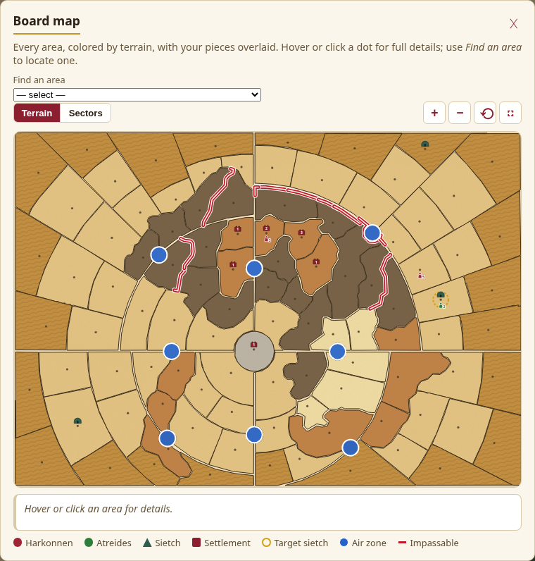
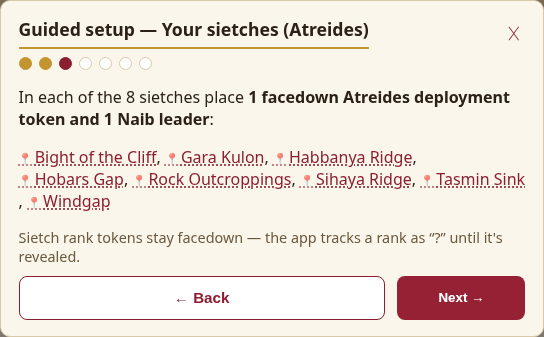
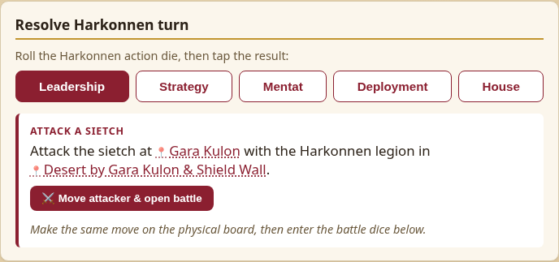
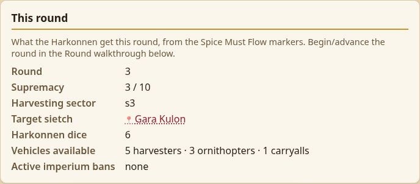
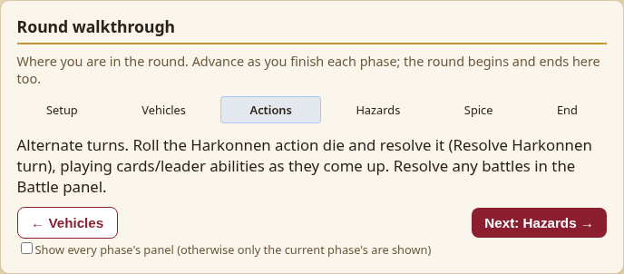
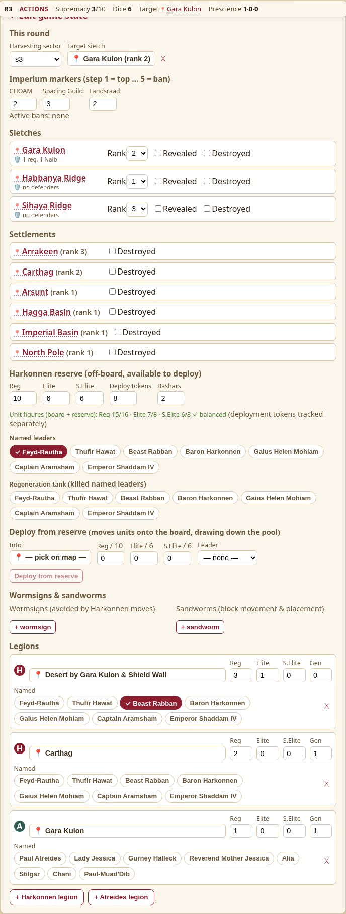
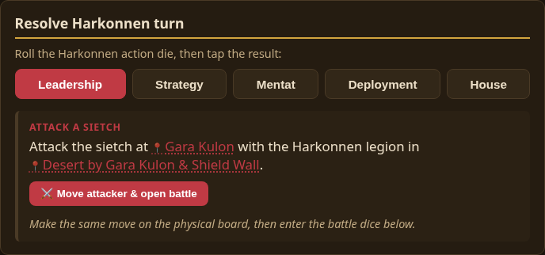
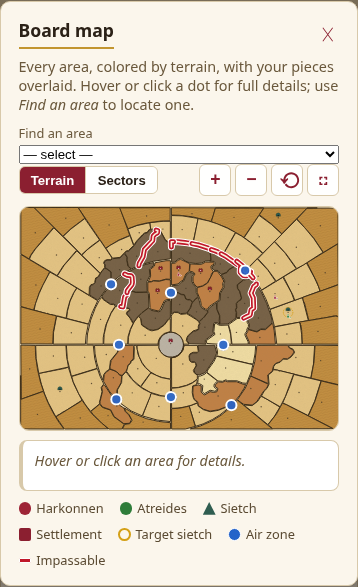

# Dune: War for Arrakis — Mahdi Solo Companion

A web app that plays the **Harkonnen "AI"** for you in the **Mahdi solo mode** of the board game
*Dune: War for Arrakis*.

In Mahdi solo you run the Atreides on the physical board and must manually execute the Harkonnen
side — nested priority lists for action‑die resolution, shortest‑path movement, combat, deployment,
desert hazards and the economy. This app automates all of that: keep it in sync with your table and,
on the Harkonnen's turn, it tells you exactly what they do. **The physical board stays the source of
truth; the app is the co‑processor.**

🎲 **Live app:** https://dune-war-for-arrakis.kdc.sh

> Fan‑made companion for solo play. Not affiliated with or endorsed by the publisher; contains no
> game art or rules text — just the state the AI needs to make its decisions.

---

## Screenshots

### Interactive board map
Every one of the 101 areas, drawn as its real traced shape and colored by terrain, with sand‑grain
texture, deep‑desert ripples, the board's double‑red impassable walls, air zones — and your whole
game state as **original hand‑drawn silhouettes**: trooper figures with stack counts, sietch arches,
settlement keeps, harvester crawlers, sandworm maws vs wormsign ripples, and wing marks for
ornithopters/carryalls. It opens as a floating overlay from the **🗺 button** anywhere on the page.
Whenever you set an area (a legion, wormsign, the target sietch, a move destination…) the map pops
open to **pick it by tapping — only rule‑legal areas are selectable**, the rest are dimmed. Any area
name anywhere in the app is a clickable 📍 chip that jumps here and pulses the spot. Pinch‑zoom & pan
on touch.



### Guided setup & teach‑the‑solo‑mode
A step‑by‑step wizard walks a brand‑new player through laying out the physical board — every listed
area is a tappable chip that pulses the map — and ends with the matching in‑app game plus a
"how a round flows" primer.



### Run the Harkonnen turn
Roll the physical action die, tap the face, and the app gives a plain‑English directive — applying
the mechanical ones for you and leaving dice‑driven ones (attacks) to resolve on the board.



### Round walkthrough & status
A phase tracker that guides you step‑by‑step through the round, alongside what the Harkonnen get this
round from the Spice Must Flow markers.




### Game‑state editor
Match the app to your table: imperium markers, legions, sietch/settlement ranks, the Harkonnen
reserve, wormsigns & sandworms. Every area is set **map‑first** — tap a 📍 field and choose the spot on
the board instead of hunting through a dropdown of (often unnamed) area names. A **Deploy from
reserve** form moves units onto the board while drawing down the pool, so board and reserve totals
never drift.



### Night on Arrakis
A dark theme for evening play (🌙 in the header), with the whole UI swept for contrast and the
accent kept in the Harkonnen crimson family.



### Works on a phone — and installs as an app
Responsive layout with tap‑friendly −/+ steppers for all dice entry; the board map supports
pinch‑zoom and pan. It's a **PWA**: install it to your phone/tablet home screen and it works
offline at the table.



---

## Features

- **Full Harkonnen decision engine** — action‑die resolution (Leadership/Strategy/Mentat/Deployment/
  House) via the solo priority cascade, shortest‑path movement with all tie‑breakers, stacking
  limits (CHOAM ban aware), the "cease attack" rule, deployment, vehicle placement, and
  planning‑card / named‑leader special abilities.
- **Both victory paths** — the Harkonnen supremacy track *and* the Atreides Secret Objective:
  track your 3 prescience markers, take testing stations, destroy settlements, and the app
  announces the winner with a proper end‑of‑game screen.
- **Your‑turn panel (Atreides)** — record what the AI depends on without touching the editor:
  prescience & objective, sietch reveals (with the voluntary‑reveal reinforcement rule), testing
  stations, settlement destruction, and the solo Bene Gesserit rule.
- **Round‑by‑round battle resolver** — attack directives hand off straight into the Battle panel
  (attacker moved in for you); deployment tokens flip to units, then each round applies the
  Harkonnen casualty priority, **named‑leader combat strips for both sides** (all 8 Atreides/Fremen
  leaders included), reinforcement spending, reserve replenishment, and destroys a taken sietch.
- **Desert Hazards & Spice Must Flow** — official wormsign placement, Coriolis storms, and a
  harvesting panel that previews and applies the solo spice allocation, completing the round in‑app.
- **Floating board map, map‑first everywhere** — every area you set is picked by tapping the board,
  with **only rule‑legal areas selectable** (moves respect sandriding, troop‑transport, and stacking
  room; deploys respect settlements and capacity). All artwork is original: traced area shapes,
  hand‑drawn piece silhouettes, sand texture, the double‑red impassable walls.
- **Guided setup & onboarding** — a wizard lays out the physical board step by step and teaches the
  round flow; a phase‑gated walkthrough then drives every round from one stepper.
- **Quality of life** — sticky status strip (round · phase · supremacy · dice · target ·
  prescience), undo with a full action history, toasts + sound cues for every applied action,
  dark theme, tap‑friendly steppers.
- **Persistence & install** — auto‑save, multiple named saves, JSON export/import, and a PWA
  service worker so it installs and runs offline.
- **Built to be trustworthy** — a headless, pure‑TypeScript engine covered by **275 unit tests**,
  plus a **full‑game Playwright E2E suite** (five player journeys, run on every push in CI).

## How it works

You play **Atreides** on the table. The app models the board state the AI rules need, then on the
Harkonnen turn it reads that state and decides their action. You keep the app and the board in sync
via the **Edit game state** panel (or the 📍 map picker), and the **Round walkthrough** guides you
through each phase.

## Getting started

```bash
npm install
npm run dev        # local dev server (http://localhost:5173)
```

Other scripts:

```bash
npm run build      # type-check + production build to dist/
npm run preview    # serve the production build
npm test           # run the engine test suite (vitest)
npm run test:e2e   # full-game Playwright suite (needs a build; CI installs its own chromium)
npm run typecheck  # tsc --noEmit
```

## Tech & layout

- **React 18 + TypeScript + Vite.** No UI framework dependencies beyond React.
- `src/engine/` — the **headless, pure‑TS rules engine** (no React import); every rule is unit‑tested.
- `src/ui/` — the React UI layer that renders engine output and edits state.
- `src/engine/board.ts` & `boardPositions.ts` — the 101‑area board graph and map coordinates
  (generated; see `scripts/`).

## Deployment & releases

- **Continuous deploy:** every push to `main` runs `.github/workflows/deploy.yml` (type‑check →
  tests → build → publish `dist/` to GitHub Pages at **https://dune-war-for-arrakis.kdc.sh**). The
  custom domain is pinned by `public/CNAME`, which Vite copies into every build.
- **Versioned releases:** pushing a `vX.Y.Z` tag runs `.github/workflows/release.yml`, which builds,
  tests, and publishes a GitHub Release with auto‑generated notes and a zipped `dist/`. See
  [RELEASING.md](RELEASING.md) for the one‑command flow, and [CHANGELOG.md](CHANGELOG.md) for history.

## Contributing

Contributions welcome — see [CONTRIBUTING.md](CONTRIBUTING.md) for the project layout, dev setup,
and conventions (game rules live in the tested pure‑TS engine; the UI stays rules‑free).

## Status

The Mahdi‑solo experience is feature‑complete and shipped: the full Harkonnen AI, both victory
paths, guided onboarding, and a CI‑run end‑to‑end suite that plays complete games through the UI.
See `PLAN.md` for the remaining backlog (small p9 edge cases) and history.

## Disclaimer

This is an **unofficial fan companion** for solo play of *Dune: War for Arrakis*. It is not
affiliated with or endorsed by CMON, Gale Force Nine, or Herbert Properties LLC. No game art,
card scans, or components are reproduced — the board map is an original schematic and all rules
references are paraphrased for personal play. You need your own copy of the physical game.
