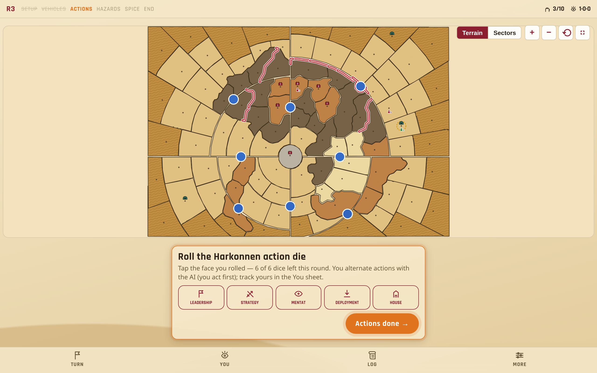
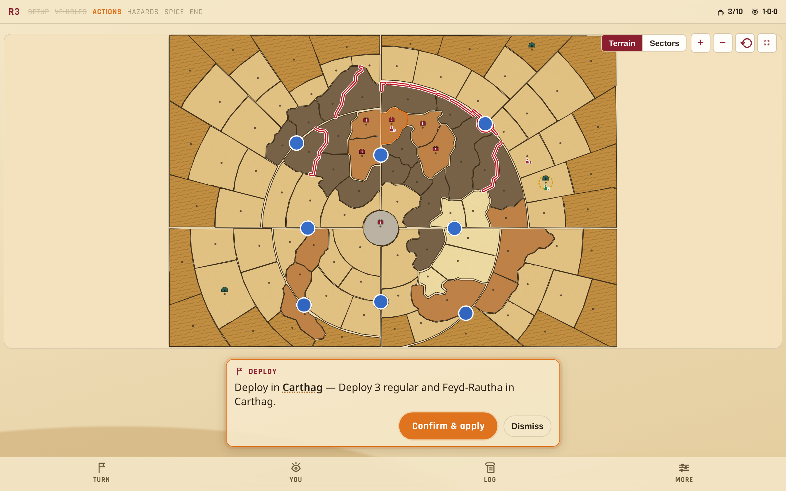
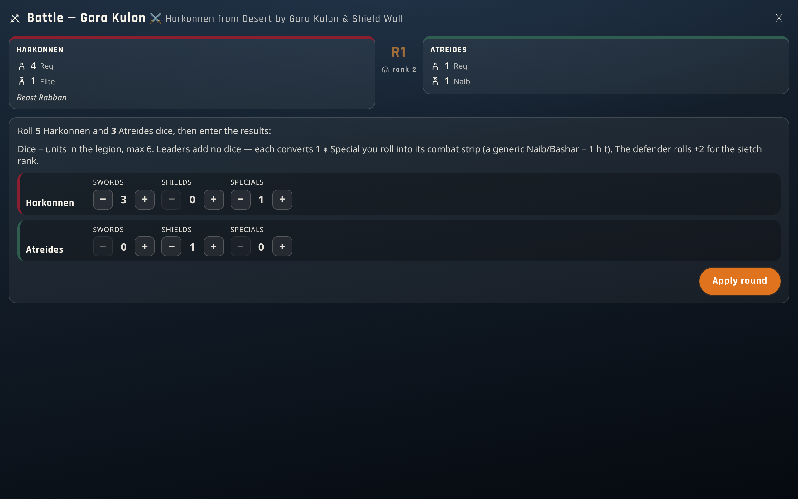
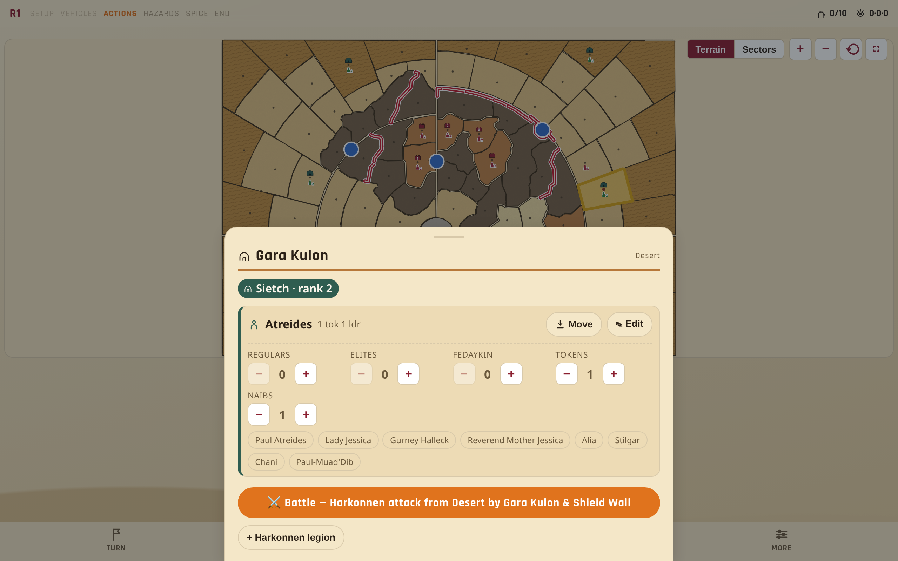
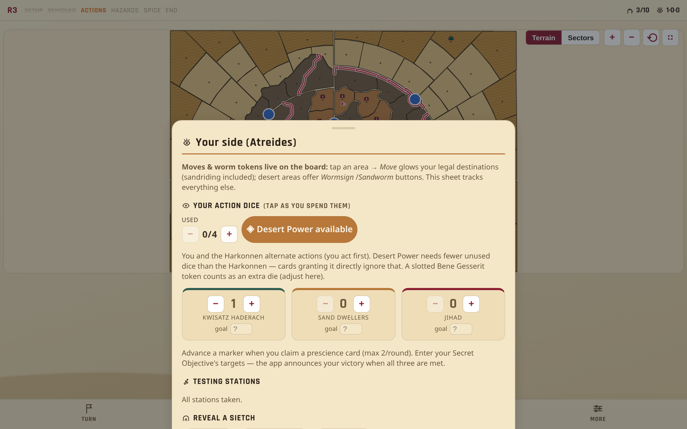
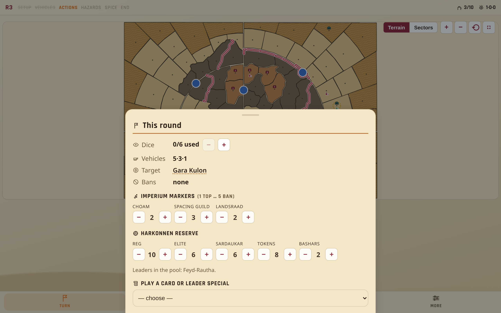
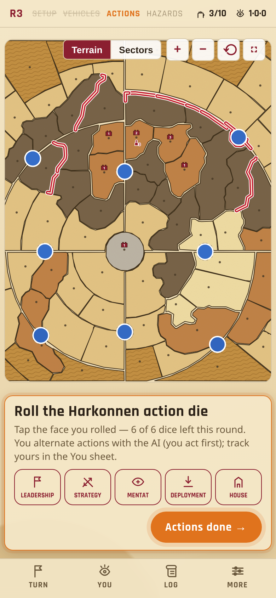

# Dune: War for Arrakis — Mahdi Solo Companion

A web app that plays the **Harkonnen "AI"** for you in the **Mahdi solo mode** of the board game
*Dune: War for Arrakis*.

In Mahdi solo you run the Atreides on the physical board and must manually execute the Harkonnen
side — nested priority lists for action‑die resolution, shortest‑path movement, combat, deployment,
desert hazards and the economy. This app automates all of that: keep it in sync with your table and,
on the Harkonnen's turn, it tells you exactly what they do. **The physical board stays the source of
truth; the app is the co‑processor.**

🎲 **Live app:** https://dune-war-for-arrakis.kdc.sh

> Fan‑made companion for solo play. Not affiliated with or endorsed by the publisher; contains no
> game art or rules text — just the state the AI needs to make its decisions.

---

## Screenshots

### The board is the app
The full‑viewport stage shows all 101 areas as their real traced shapes, colored by terrain with
sand‑grain texture, deep‑desert ripples, the double‑red impassable walls, air zones — and your whole
game state as **original hand‑drawn silhouettes** (troopers with stack counts, sietch arches,
settlement keeps, harvesters, sandworm maws vs wormsign ripples). The spice‑orange **guide bar**
always shows the one next thing to do; the status ribbon tracks round · phase · supremacy ·
prescience, and four dock buttons open everything else as bottom sheets.



### Run the Harkonnen turn
Roll the physical action die and tap the face: the AI's directive appears as a card — the areas it
touches glow on the stage, mechanical effects apply with one tap, and attacks hand off to the battle
screen. The app counts the dice for you (they disable when the round's pool is spent).



### Battles, both directions
A full‑screen night‑palette takeover for each fight — the Harkonnen AI attacking you, or **you
attacking an adjacent Harkonnen legion**. Facedown tokens flip first, each side's units are labeled,
the dice math is explained inline (units roll; leaders convert ✴ Specials via their combat strips —
all 15 named leader cards from both sides are modeled), and the engine applies casualty priorities,
reinforcements, the sietch/settlement assault rules, and the victor's advance.



### Tap any area
The area sheet shows what's there and edits it in place: unit steppers, deployment tokens,
**named‑leader chips for both factions**, wormsign/sandworm tools, rule‑filtered legion moves
(legal destinations glow on the stage), and one‑tap battles against adjacent enemies.



### Your side of the table
The You sheet tracks the Atreides: action dice (with the **Desert Power gate** computed live),
prescience dials and your Secret Objective, testing stations, sietch reveals, settlement
destruction, the Bene Gesserit rule — and a reference for **all 36 of your planning cards**.
The Turn sheet mirrors it for the Harkonnen: imperium markers, the reserve, and every House
Harkonnen / Corrino card and named‑leader special, with auto‑applicable steps.




### Guided setup & onboarding
A first‑run welcome offers a step‑by‑step wizard that lays out the physical board — every listed
area is a tappable chip that pulses the stage — and ends with the matching in‑app game plus a
"how a round flows" primer.


### Night on Arrakis
A dark theme for evening play (in the More sheet), swept for contrast across every surface.


### Works on a phone — and installs as an app
The stage adapts its camera to the viewport; sheets and steppers are tap‑friendly. It's a **PWA**:
install it to your phone/tablet home screen and it works offline at the table.



---

## Features

- **Full Harkonnen decision engine** — action‑die resolution (Leadership/Strategy/Mentat/Deployment/
  House) via the solo priority cascade, shortest‑path movement with all tie‑breakers, stacking
  limits (CHOAM ban aware), the "cease attack" rule, deployment, vehicle placement, and
  planning‑card / named‑leader special abilities.
- **Both victory paths** — the Harkonnen supremacy track *and* the Atreides Secret Objective:
  track your 3 prescience markers, take testing stations, destroy settlements, and the app
  announces the winner with a proper end‑of‑game screen.
- **Your‑turn tracking (Atreides)** — action dice with the live **Desert Power gate**, prescience &
  objective, sietch reveals (with the voluntary‑reveal reinforcement rule), testing stations,
  settlement destruction, the solo Bene Gesserit rule, and a full **36‑card planning‑deck
  reference**.
- **Round‑by‑round battle resolver, both directions** — the AI's attacks hand off straight into the
  battle screen, and you can attack adjacent Harkonnen legions yourself (cease any round; taking a
  settlement destroys it and advances your prescience). Deployment tokens flip to units, then each
  round applies casualty priorities, **named‑leader combat strips for both sides** (all 15 leader
  cards modeled), reinforcement spending, reserve replenishment, assault costs, and the victor's
  advance per the rulebook.
- **Desert Hazards & Spice Must Flow** — official wormsign placement, Coriolis storms, and a
  harvesting panel that previews and applies the solo spice allocation, completing the round in‑app.
- **Board‑first everywhere** — the stage is the interface: tap an area to inspect or edit it, and
  every "where" is picked on the board with **only rule‑legal areas selectable** (moves respect
  sandriding, troop‑transport, and stacking room). All artwork is original: traced area shapes,
  hand‑drawn piece silhouettes, sand texture, the double‑red impassable walls.
- **Guided setup & onboarding** — a wizard lays out the physical board step by step and teaches the
  round flow; a phase‑gated walkthrough then drives every round from one stepper.
- **Quality of life** — sticky status strip (round · phase · supremacy · dice · target ·
  prescience), undo with a full action history, toasts + sound cues for every applied action,
  dark theme, tap‑friendly steppers.
- **Persistence & install** — auto‑save, multiple named saves, JSON export/import, and a PWA
  service worker so it installs and runs offline.
- **Built to be trustworthy** — a headless, pure‑TypeScript engine covered by **290 unit tests**,
  plus a **full‑game Playwright E2E suite** (nine player journeys, including a complete campaign
  from round 1 to victory, run on every push in CI).

## How it works

You play **Atreides** on the table. The app models the board state the AI rules need, then on the
Harkonnen turn it reads that state and decides their action. You keep the app and the board in sync
by tapping areas on the stage (the area sheet edits everything in place), and the **guide bar**
walks you through each phase — it always shows the one next thing to do.

## Getting started

```bash
npm install
npm run dev        # local dev server (http://localhost:5173)
```

Other scripts:

```bash
npm run build      # type-check + production build to dist/
npm run preview    # serve the production build
npm test           # run the engine test suite (vitest)
npm run test:e2e   # full-game Playwright suite (needs a build; CI installs its own chromium)
npm run typecheck  # tsc --noEmit
```

## Tech & layout

- **React 18 + TypeScript + Vite.** No UI framework dependencies beyond React.
- `src/engine/` — the **headless, pure‑TS rules engine** (no React import); every rule is unit‑tested.
- `src/ui2/` — the board‑first UI shell (stage, guide bar, sheets, battle screen).
- `src/ui/` — shared React modules (board map, setup wizard, persistence, sound).
- `src/engine/board.ts` & `boardPositions.ts` — the 101‑area board graph and map coordinates
  (generated; see `scripts/`).

## Deployment & releases

- **Continuous deploy:** every push to `main` runs `.github/workflows/deploy.yml` (type‑check →
  tests → build → publish `dist/` to GitHub Pages at **https://dune-war-for-arrakis.kdc.sh**). The
  custom domain is pinned by `public/CNAME`, which Vite copies into every build.
- **Versioned releases:** pushing a `vX.Y.Z` tag runs `.github/workflows/release.yml`, which builds,
  tests, and publishes a GitHub Release with auto‑generated notes and a zipped `dist/`. See
  [RELEASING.md](RELEASING.md) for the one‑command flow, and [CHANGELOG.md](CHANGELOG.md) for history.

## Contributing

Contributions welcome — see [CONTRIBUTING.md](CONTRIBUTING.md) for the project layout, dev setup,
and conventions (game rules live in the tested pure‑TS engine; the UI stays rules‑free).

## Status

**v1.0.0** — the board‑first interface is the app: the full Harkonnen AI, battles in both
directions, both victory paths, all 4 planning decks and 15 named‑leader cards modeled, dice
accounting for both sides, guided onboarding, and a CI‑run end‑to‑end suite that plays complete
campaigns through the UI. Next up: a configurable human‑like Harkonnen AI with difficulty levels
(see `PLAN.md`).

## Disclaimer

This is an **unofficial fan companion** for solo play of *Dune: War for Arrakis*. It is not
affiliated with or endorsed by CMON, Gale Force Nine, or Herbert Properties LLC. No game art,
card scans, or components are reproduced — the board map is an original schematic and all rules
references are paraphrased for personal play. You need your own copy of the physical game.
